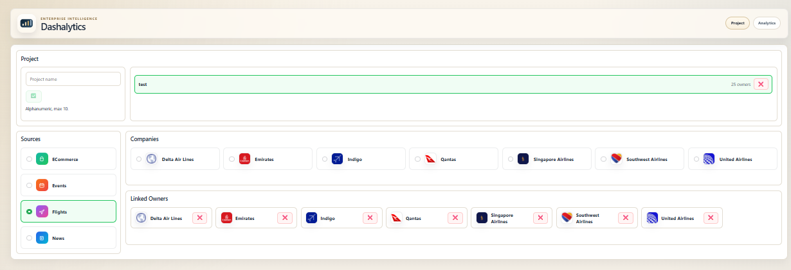
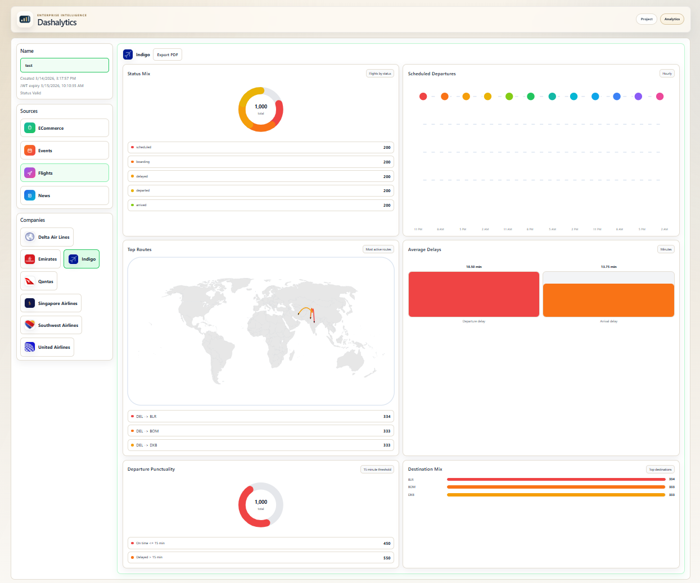
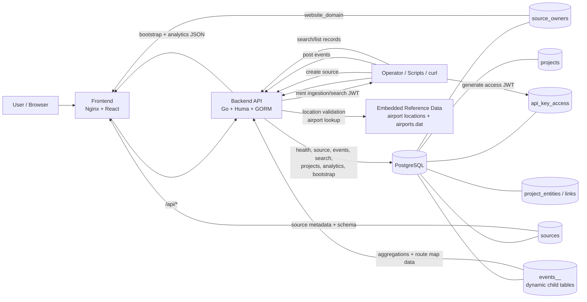

<a id="top"></a>

# Table of Contents
- [Description](#description)
- [Main Features](#main-features)
- [Tech Stack](#tech-stack)
- [Data Model (Current)](#data-model-current)
- [Architecture Diagram](#architecture-diagram)
- [Run with Docker](#run-with-docker)
- [Local Development](#local-development)
- [TODO](#todo)
- [Development Attribution](#development-attribution)
- [Special Notes](#special-notes)

## Description

A source-driven ingestion API and dashboard for `Events`, `News`, `ECommerce`, and `Flights`, backed by PostgreSQL with JWT-based access control, dynamic child tables, per-owner replay protection, and a frontend workspace for project linking and analytics.

### Projects View


### Analytics View


[Back to top](#top)

## Main Features
- Backend:
  - Stores sources, source owners, projects, and dynamic event tables in PostgreSQL
  - Validates source locations, schemas, and event payloads before writes
  - Issues JWTs for access and ingestion flows
  - Enforces replay protection and serves analytics data
- Frontend:
  - Provides a projects workspace to link sources and companies
  - Loads analytics views for each linked company
  - Renders company favicons from `websiteDomain` when available
  - Proxies `/api/*` requests to the backend
- Scripts:
  - Generate JWTs, create sources, list records, and seed sample source/event data

[Back to top](#top)

## Tech Stack
- Frontend: React, Vite, Nginx
- Backend: Go, Huma, GORM
- Database: PostgreSQL 17
- Runtime: Docker, Docker Compose
- HostOS / Virtualization: Windows 11 / Hyper-V
- Linux Emulation: WSL Ubuntu
- `bash` clis: `curl`, `jq`, `openssl`
- Script Integration:  Python 3

[Back to top](#top)

## Data Model (Current)
- `sources`: source metadata plus the JSON schema used by the owner
- `source_owners`: shared owner metadata for `source + company`, including `website_domain`
- `api_key_access`: signing secrets, issuers, subjects, and ingestion TTL settings
- `events_<normalized-source>_<normalized-company>`: dynamic child tables for each `source + company` owner
- Source ownership rules:
  - `source + company` determines the shared child table
  - `source + company` determines the shared `source_owners` row
  - `source + company + city + state + country` determines the specific source record
- Replay-protection rules:
  - Replay protection is enforced per `source_parent_id`, not globally across an owner table
  - The replay key depends on the canonical source type and available schema columns
  - Different source records under the same owner may reuse the same replay key value
- Table naming rules:
  - Child tables are named as `events_<normalized-source>_<normalized-company>`
  - If the generated name exceeds PostgreSQL's 63-character limit, it is truncated and suffixed with a hash

[Back to top](#top)

## Architecture Diagram


[Back to top](#top)

## Run with Docker
1. Copy env file:
   ```bash
   cp .env.example .env
   ```
2. Create the volume directory and update your `.env` file accordingy:
   ```bash
   mkdir -p <voldir>
   chown -R 70:70 <voldir>
   chmod -R 700 <voldir>
   cat >> .env << EOF
   DB_VOLUME=${pwd}/<db-vol-dir>
   EOF
   ```
3. Start the stack from the repo root:
   ```bash
   docker compose -f docker-compose.yml --env-file .env up --build
   ```
4. Check the health endpoint:
   ```bash
   curl -sS http://localhost:3000/healthz
   ```
5. The API will be available at `http://localhost:3000`.
6. The dashboard frontend will be available at `http://localhost:8081`.

[Back to top](#top)

## Local Development
Local development is centered on the Docker Compose stack.

**Services**

- Frontend: `http://localhost:8081`
- Backend: `http://localhost:3000`
- Database container: `events-dashboard-db`

**Workflow**

1. Start the stack with Docker Compose.
2. Generate an access JWT with `scripts/generate-jwt.sh -t access`.
3. Create a source with `scripts/create-source.sh`.
4. Generate an ingestion JWT with `scripts/generate-jwt.sh -t ingestion`.
5. Insert, search, or list records with the API and helper scripts.

**Key scripts**

- `scripts/generate-jwt.sh`: creates access and ingestion tokens
- `scripts/create-source.sh`: creates a source and child events table; `-w <website-domain>` is required
- `scripts/list-records.sh`: lists records for a source owner
- `scripts/<domain>/source/*.sh`: creates seeded sources
- `scripts/<domain>/events/*.sh`: posts seeded events

**Main endpoints**

- `GET /healthz`: health check
- `GET /api-key`: returns an ingestion/search JWT from an access JWT
- `POST /source`: creates a source row and child table
- `GET /source`: lists source rows
- `POST /events`: inserts an event
- `GET /search`: searches records for a `source + company`

**Testing**

Run backend tests from [docker/backend/](docker/backend):

```bash
go test ./...
```

[Back to top](#top)

## TODO
1. Integrate TLS/SSL.
2. Architecture needs to be redesigned:
   - Add a messaging layer.
   - Move towards a user-based AuthN/AuthZ.
   - Add per-user time-bound access/ingestion JWT/ via the UI.
   - Add source (admin)/company (user) CRUD via the UI.
   - Add source/company-based analytics CRUD via the UI.

[Back to top](#top)

## Development Attribution
- Principal developer: Codex (GPT-5 coding agent). _// old N00b � assisted a bit_
- Collaboration model: iterative prompt-driven development in the local repo with incremental implementation, debugging, and U
X refinement.

### Prompt Summary (Consolidated)

- Run the application locally with Docker Compose using the renamed `events-dashboard-db`, `events-dashboard-backend`, and `events-dashboard-frontend` services.
- Expose the backend API on `localhost:3000` and the frontend on `localhost:8081`, with the frontend reverse-proxying API traffic to the backend service.
- Use the backend to manage source owners, source records, projects, linked companies, analytics payloads, and dynamic per-owner event tables in PostgreSQL.
- Require `websiteDomain` when creating new sources so company favicon rendering comes from explicit source metadata rather than depending on legacy backend fallbacks.
- Preserve stored `website_domain` values across backend restarts so migrations and owner backfills do not wipe manually set or newly created company domains.
- Use helper scripts to generate access JWTs, mint ingestion/search JWTs, create sources, list records, and seed sample data for `Events`, `News`, `ECommerce`, and `Flights`.
- Create seeded source scripts under `scripts/<domain>/source/` and seeded event scripts plus JSON fixtures under `scripts/<domain>/events/` so new demo companies can be added consistently.
- Validate source locations, schema definitions, and event payloads in the backend before writes, including required fields, normalized column names, reserved-name checks, and owner-schema consistency.
- Store shared company metadata in `source_owners`, including `website_domain`, and expose that domain through source and bootstrap API responses so the frontend can render company favicons in project selection views.
- Render frontend company visuals in two layers: generic source thumbnails derived from source type, and company favicons derived from `websiteDomain` when present.
- Support analytics views in the frontend for linked companies, including dashboards, charts, and flight route maps driven by backend analytics endpoints.
- Build flight route maps from embedded airport reference data instead of a small hardcoded airport map so routes for newly added companies and broader airport coverage continue to resolve correctly.
- Use embedded airport/location datasets in the backend for both source location validation and flight coordinate lookup, keeping route analytics and source creation aligned with the same reference data.

[Back to top](#top)

## Special Notes
- The API listens on `APP_PORT`, default `3000`
- The frontend is published on `FRONTEND_PORT`, default `8081`
- The app accepts either `HOST` or `APP_HOST` for the bind address, default `0.0.0.0`
- The app accepts either `PORT` or `APP_PORT` for the public port, default `3000`
- `DATABASE_URL` can be provided directly; otherwise it is assembled from the `DB_*` variables plus `DB_SSLMODE` defaulting to `disable`
- `docker-compose.yml` bind-mounts PostgreSQL data from `DB_VOLUME`
- Docker Compose service/container names use the `events-dashboard-*` prefix

Schema and event validation rules:

- `tableSchema` must contain at least one column
- Column names are normalized to lowercase snake_case
- Reserved column names are rejected: `id`, `source_parent_id`, `source`, `company`, `city`, `state`, `country`, `created_at`
- Duplicate normalized column names are rejected
- The source identity must already exist before posting events

[Back to top](#top)
