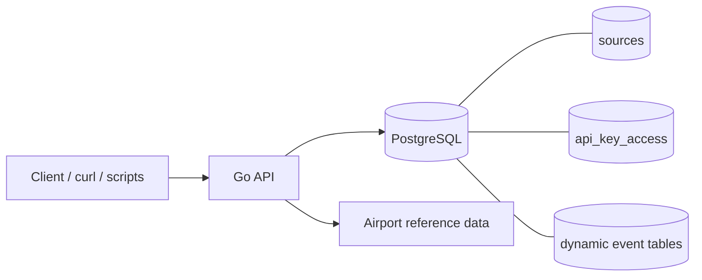

<a id="top"></a>

# events-dashboard

A source-driven ingestion API for `Events`, `News`, `ECommerce`, and `Flights`, backed by PostgreSQL with JWT-based access control, dynamic child tables, and per-owner replay protection.

## Table of Contents
- [Main Features](#main-features)
- [Tech Stack](#tech-stack)
- [Data Model (Current)](#data-model-current)
- [Architecture Diagram](#architecture-diagram)
- [Run with Docker](#run-with-docker)
- [Local Development](#local-development)
- [TODO](#todo)
- [Development Attribution](#development-attribution)
- [Environment Variables](#environment-variables)

## Main Features
- Source-managed ingestion model:
  - A source record is uniquely identified by `source + company + city + state + country`
  - Event rows are stored in a child table shared by the owning `source + company`
- Dynamic schema support:
  - Each owner defines its payload schema through `tableSchema`
  - Supported column types are `text`, `integer`, `bigint`, `boolean`, `numeric`, `timestamptz`, and `jsonb`
- JWT-based access model:
  - Access JWT for `GET /api-key`, `POST /source`, and `GET /source`
  - Ingestion/search JWT for `POST /events` and `GET /search`
- Validation and normalization:
  - Allowed source names are `Events`, `News`, `ECommerce`, and `Flights`
  - Source matching is case-insensitive and stored in canonical form
  - `company`, `city`, and `state` are normalized to title case
  - `country` is trimmed and validated against embedded airport reference data
  - `city + state + country` must match the embedded airport location reference
  - Required payload fields cannot be missing or `null`
  - Unknown payload fields are rejected
- Replay protection:
  - New child tables get a unique replay index when the schema contains the domain replay key
  - Duplicate inserts return `409 Conflict`
  - Existing rows are deduplicated during migration by keeping the earliest row per `source_parent_id + replay_key`
  - Replay keys currently used are `article_id` for `News`, `flight_id` for `Flights`, `invoice_number` or `event_id` for `Events`, and `order_id`, `invoice_number`, or `transaction_id` for `ECommerce`
- Automated startup behavior:
  - Runs database migrations
  - Removes the legacy shared `events` table
  - Migrates legacy source rows to the canonical source/location model
  - Seeds the singleton `api_key_access` row if needed
- Helper scripts:
  - `scripts/generate-jwt.sh` for access and ingestion token generation
  - `scripts/create-source.sh` for source creation
  - `scripts/{events,news,ecommerce,flights}/generate_assets.py` for sample source/event fixtures and shell helpers

[Back to top](#top)

## Tech Stack
- API: Go, Huma, GORM
- Database: PostgreSQL 17
- Runtime: Docker, Docker Compose
- Tooling: Bash, `curl`, `jq`, `openssl`, Python 3
- Reference data: embedded airport location CSV

[Back to top](#top)

## Data Model (Current)
- `sources`: source metadata plus the JSON schema used by the owner
- `api_key_access`: signing secrets, issuers, subjects, and ingestion TTL settings
- `events_<normalized-source>_<normalized-company>`: dynamic child tables for each `source + company` owner
- Source ownership rules:
  - `source + company` determines the shared child table
  - `source + company + city + state + country` determines the specific source record
- Replay-protection rules:
  - Replay protection is enforced per `source_parent_id`, not globally across an owner table
  - The replay key depends on the canonical source type and available schema columns
  - Different source records under the same owner may reuse the same replay key value
- Table naming rules:
  - Child tables are named as `events_<normalized-source>_<normalized-company>`
  - If the generated name exceeds PostgreSQL's 63-character limit, it is truncated and suffixed with a hash

[Back to top](#top)

## Architecture Diagram


[Back to top](#top)

## Run with Docker
1. Make sure Docker with Compose support is installed.
2. Make sure `curl`, `jq`, and `openssl` are available on the host.
3. Create the PostgreSQL bind-mount directory from [.env](.env):
   ```bash
   mkdir -p <voldir>
   chown -R 70:70 <voldir>
   chmod -R 700 <voldir>
   ```
4. Start the stack from the repository root:
   ```bash
   docker compose -f docker-compose.yml --env-file .env up --build
   ```
5. Check the health endpoint:
   ```bash
   curl -sS http://127.0.0.1:3000/healthz
   ```
6. The API will be available at `http://127.0.0.1:3000`.

[Back to top](#top)

## Local Development
Most workflows in this repo assume the Docker Compose stack is running.

**Relevant paths**

- [README.md](README.md)
- [docker-compose.yml](docker-compose.yml)
- [.env](.env)
- [docker/backend/](docker/backend)
- [docker/backend/cmd/api/main.go](docker/backend/cmd/api/main.go)
- [docker/backend/internal/api/](docker/backend/internal/api)
- [docker/backend/internal/store/store.go](docker/backend/internal/store/store.go)
- [docker/backend/internal/testutil/postgres.go](docker/backend/internal/testutil/postgres.go)
- [docker/backend/internal/reference/airport_locations.csv](docker/backend/internal/reference/airport_locations.csv)
- [scripts/generate-jwt.sh](scripts/generate-jwt.sh)
- [scripts/create-source.sh](scripts/create-source.sh)
- [scripts/events/](scripts/events)
- [scripts/news/](scripts/news)
- [scripts/ecommerce/](scripts/ecommerce)
- [scripts/flights/](scripts/flights)

**Authentication model**

- Access JWT:
  - Signed with the access secret stored in `api_key_access`
  - Used for source management and minting ingestion/search JWTs
  - Non-expiring in the current implementation
- Ingestion/search JWT:
  - Signed with the ingestion secret stored in `api_key_access`
  - Used for `POST /events` and `GET /search`
  - Default TTL is `3600` seconds

Generate tokens with:

```bash
scripts/generate-jwt.sh -t access
scripts/generate-jwt.sh -t ingestion
```

Notes:

- `scripts/generate-jwt.sh -t access` reads JWT config from the `db` container and signs the token locally
- `scripts/generate-jwt.sh -t ingestion` first builds the access token, then calls `GET /api-key` and extracts `.apiKey`

**Common workflow**

1. Start the stack.
2. Generate an access token.
3. Create a source record and its child table.
4. Generate an ingestion token.
5. Insert events.
6. Search events.

Quick example:

```bash
ACCESS_JWT="$(scripts/generate-jwt.sh -t access)"
```

Create a source:

```bash
ACCESS_JWT="$ACCESS_JWT" scripts/create-source.sh \
  -s "Events" \
  -c "Acme" \
  -i "Boston" \
  -t "Massachusetts" \
  -n "United States" \
  -j '[{"name":"invoice_number","type":"text","required":true},{"name":"amount","type":"numeric","required":false}]'
```

Fetch an ingestion token:

```bash
INGESTION_JWT="$(scripts/generate-jwt.sh -t ingestion)"
```

Insert an event:

```bash
curl -sS \
  -X POST \
  -H "Authorization: Bearer $INGESTION_JWT" \
  -H "Content-Type: application/json" \
  -d '{
    "source": "Events",
    "company": "Acme",
    "city": "Boston",
    "state": "Massachusetts",
    "country": "United States",
    "payload": {
      "invoice_number": "INV-100",
      "amount": 12.5
    }
  }' \
  http://127.0.0.1:3000/events
```

Search:

```bash
curl -sS \
  -H "Authorization: Bearer $INGESTION_JWT" \
  "http://127.0.0.1:3000/search?source=Events&company=Acme&q=INV"
```

**Generated fixture assets**

- Each domain folder contains a `generate_assets.py` script that writes:
  - `source/*.sh` helpers for creating canonical sources
  - `events/*.sh` helpers for bulk posting fixture events
  - `events/*_events.json` fixture datasets
- The generated event scripts treat `409` responses as duplicate detections and fail at the end if duplicates were seen.

**API summary**

| Method | Path | Auth | Purpose |
| --- | --- | --- | --- |
| `GET` | `/healthz` | none | Health check |
| `GET` | `/api-key` | access JWT | Issue ingestion/search JWT |
| `POST` | `/source` | access JWT | Create a source row and child table |
| `GET` | `/source` | access JWT | List source rows |
| `POST` | `/events` | ingestion/search JWT | Insert an event into the matching child table |
| `GET` | `/search` | ingestion/search JWT | Search events inside the child table for a `source + company` owner |

**Endpoint details**

- `GET /healthz`
  - Checks whether the API can reach PostgreSQL
  - Example:
    ```bash
    curl -sS http://127.0.0.1:3000/healthz
    ```
- `GET /api-key`
  - Returns a short-lived ingestion/search JWT
  - Response fields: `apiKey`, `expiresAt`
  - Example:
    ```bash
    curl -sS \
      -H "Authorization: Bearer $ACCESS_JWT" \
      http://127.0.0.1:3000/api-key
    ```
- `POST /source`
  - Creates a source record
  - If this is the first record for a given `source + company`, the API creates a child table named from that owner pair
  - If the owner already exists, the incoming schema must match the existing schema exactly
  - Required body fields: `source`, `company`, `city`, `state`, `country`, `tableSchema`
  - `tableSchema` must be a non-empty JSON array of column definitions with `name`, `type`, and `required`
  - Allowed column types: `text`, `integer`, `bigint`, `boolean`, `numeric`, `timestamptz`, `jsonb`
  - Example:
    ```bash
    curl -sS \
      -X POST \
      -H "Authorization: Bearer $ACCESS_JWT" \
      -H "Content-Type: application/json" \
      -d '{
        "source": "Events",
        "company": "Acme",
        "city": "Boston",
        "state": "Massachusetts",
        "country": "United States",
        "tableSchema": [
          {"name":"invoice_number","type":"text","required":true},
          {"name":"amount","type":"numeric","required":false}
        ]
      }' \
      http://127.0.0.1:3000/source
    ```
- `GET /source`
  - Lists source records and their child-table metadata
  - Example:
    ```bash
    curl -sS \
      -H "Authorization: Bearer $ACCESS_JWT" \
      http://127.0.0.1:3000/source
    ```
- `POST /events`
  - Creates an event row in the child table associated with the exact source identity
  - Required body fields: `source`, `company`, `city`, `state`, `country`, `payload`
  - `payload` must include every required schema field, omit unsupported fields, and use values compatible with the declared column types
  - Duplicate replay-key inserts for the same `source_parent_id` return `409 Conflict`
  - Type expectations:
    - `text` -> JSON string
    - `integer` and `bigint` -> integer value
    - `numeric` -> numeric value
    - `boolean` -> boolean value
    - `timestamptz` -> RFC3339 string
    - `jsonb` -> valid JSON value
  - Example:
    ```bash
    curl -sS \
      -X POST \
      -H "Authorization: Bearer $INGESTION_JWT" \
      -H "Content-Type: application/json" \
      -d '{
        "source": "Events",
        "company": "Acme",
        "city": "Boston",
        "state": "Massachusetts",
        "country": "United States",
        "payload": {
          "invoice_number": "INV-100",
          "amount": 12.5
        }
      }' \
      http://127.0.0.1:3000/events
    ```
- `GET /search`
  - Searches the child table for the `source + company` owner
  - Required query params: `source`, `company`
  - Optional query params: `city`, `state`, `country`, `q`, `page`
  - Search behavior:
    - `source` and `company` select the owner table
    - `city`, `state`, and `country` further filter results inside that table
    - `q` performs `ILIKE` search only across dynamic `text` payload columns
    - `page` defaults to `1`
    - Page size is fixed at `50`
  - Examples:
    ```bash
    curl -sS \
      -H "Authorization: Bearer $INGESTION_JWT" \
      "http://127.0.0.1:3000/search?source=Events&company=Acme"
    ```
    ```bash
    curl -sS \
      -H "Authorization: Bearer $INGESTION_JWT" \
      "http://127.0.0.1:3000/search?source=Events&company=Acme&city=Boston&state=Massachusetts&country=United%20States"
    ```
    ```bash
    curl -sS \
      -H "Authorization: Bearer $INGESTION_JWT" \
      "http://127.0.0.1:3000/search?source=Events&company=Acme&q=INV&page=2"
    ```

**Testing**

Run the Go test suite from [docker/backend/](docker/backend):

```bash
go test ./...
```

Integration tests that create isolated PostgreSQL databases require `EVENTS_TEST_DATABASE_URL` to be set.

[Back to top](#top)

## TODO
- No explicit project TODO list is currently maintained in this README.
- Current operational constraints and notes:
  - CORS headers are stripped from responses
  - `OPTIONS` requests return `405 Method Not Allowed`
  - An existing `source + company` owner cannot be reused with a different schema
  - Replay protection only applies when a source schema includes one of the recognized replay-key columns

[Back to top](#top)

## Development Attribution
- Current repository scope:
  - Go API service in [docker/backend/](docker/backend)
  - Docker Compose runtime in [docker-compose.yml](docker-compose.yml)
  - Core operator scripts in [scripts/generate-jwt.sh](scripts/generate-jwt.sh) and [scripts/create-source.sh](scripts/create-source.sh)
  - Domain fixture generators and helper scripts in [scripts/events/](scripts/events), [scripts/news/](scripts/news), [scripts/ecommerce/](scripts/ecommerce), and [scripts/flights/](scripts/flights)
  - Embedded location reference data in [docker/backend/internal/reference/airport_locations.csv](docker/backend/internal/reference/airport_locations.csv)

### Prompt Summary (Consolidated)
- Start the Docker Compose stack with the configured PostgreSQL bind mount
- Generate an access JWT from `api_key_access`
- Create a source using `source`, `company`, location fields, and `tableSchema`
- Generate an ingestion/search JWT through `GET /api-key`
- Insert events whose payload matches the declared schema
- Search records inside the owner table with optional location filters and text search
- Reject duplicate event replays for recognized replay-key columns
- Validate all locations against the embedded airport reference data

[Back to top](#top)

## Environment Variables
Default values in [.env](.env):

- `APP_PORT=3000`
- `DB_HOST=db`
- `DB_PORT=5432`
- `DB_NAME=events`
- `DB_USER=events`
- `DB_PASSWORD=events`
- `DB_UID=70`
- `DB_GID=70`
- `DB_VOLUME=<voldir>`

Runtime notes:

- The API listens on `APP_PORT`, default `3000`
- The app accepts either `HOST` or `APP_HOST` for the bind address, default `0.0.0.0`
- The app accepts either `PORT` or `APP_PORT` for the public port, default `3000`
- `DATABASE_URL` can be provided directly; otherwise it is assembled from the `DB_*` variables plus `DB_SSLMODE` defaulting to `disable`
- `docker-compose.yml` bind-mounts PostgreSQL data from `DB_VOLUME`

Schema and event validation rules:

- `tableSchema` must contain at least one column
- Column names are normalized to lowercase snake_case
- Reserved column names are rejected: `id`, `source_parent_id`, `source`, `company`, `city`, `state`, `country`, `created_at`
- Duplicate normalized column names are rejected
- The source identity must already exist before posting events

[Back to top](#top)
